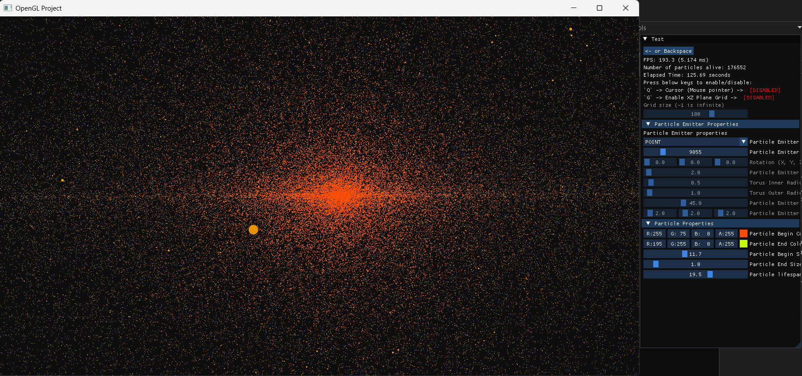

# OpenGL Explorations

This repository is a learning project that explores the fundamentals of 3D rendering with OpenGL. It includes a collection of experiments and demonstrations, integrated with ImGui for easy exploration and modification of parameters.

## Gallery
Here are some project screenshots and a video:

### Screenshots

  
  
  
  
  
  
  

### Videos
|  |  |
| --- | --- |
|  |

## Features
  - Render Game Window (Clear Color)
  - Render Triangle
  - Render Square
  - Load 2D Texture
  - Render Sphere (UV Sphere)
  - Cube Rendering With Lighting Effect and Materials
    - Multiple material options
    - Phong lighting model 
  - Cube With Texture and Lighting
    - Textured Cube with texture Diffuse, Emission and Specular
    - Phong lighting model with Attenuation
  - Fractal Brownian Motion Plane With Lighting
    - Fractal Brownian Motion Plane with Wireframe view, Rotation and each point movement.
    - Phong lighting model
  - Load and Tessellate Height Map
    - Load Height Map from png
    - Uses Tessellation and interpolation to generate 3D Height map from png
    - Uses FOV to dynamically change the tessellation levels 
    - Renders Normals
    - Uses Frustum culling
  - Load 3D model using Assimp
    - Load 3D model from obj file
    - Render 3D model with Phong lighting model
    - Renders Normals
  - Particles in 3D (Implements in CPU)
    - Uses CPU to create, update and destroy particles from emitter
    - Max number of particle alive per frame is ~30K (with Avg of 22 FPS)
  - Particles in 3D (Implements in GPU Nvidia GTX 1050)
    - Uses CPU to create, update and destroy particles from emitter
    - Max number of particle alive per frame is ~1.5 million (with Avg of 120 FPS)

## Getting Started
You can follow same instructions on `https://github.com/Shreyas9699/opengl-base-template` to set it up.
 __OR__ 
You can follow _The Cherno_ [_Instructions_](https://www.youtube.com/playlist?list=PLlrATfBNZ98foTJPJ_Ev03o2oq3-GGOS2)

### Prerequisites

- OpenGL 3.3 or higher
- GLFW
- GLEW
- GLM
- stb_image
- ImGui

## Usage

- Use the ImGui interface to modify rendering parameters in real-time.
- Explore different rendering techniques by selecting from the available demos.

## Acknowledgments

- [The Cherno](https://www.youtube.com/@TheCherno) for the OpenGL tutorials and guidance.
- [LearnOpenGL](https://learnopengl.com/) for providing excellent tutorials and resources.
- [The Book of shader](https://thebookofshaders.com/) to guide through the complex shader.