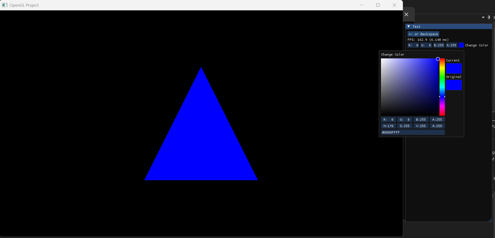
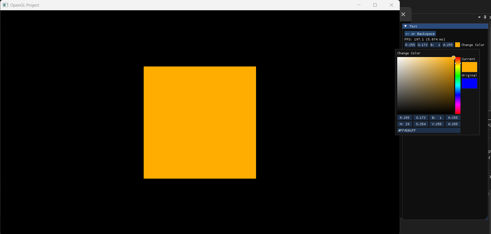
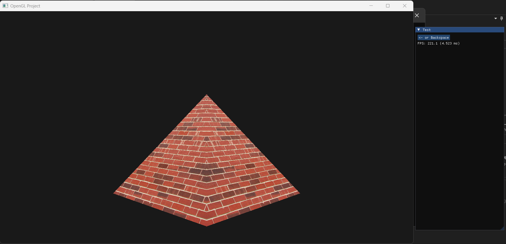
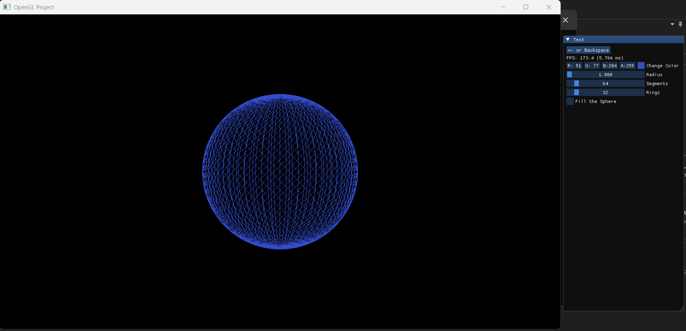
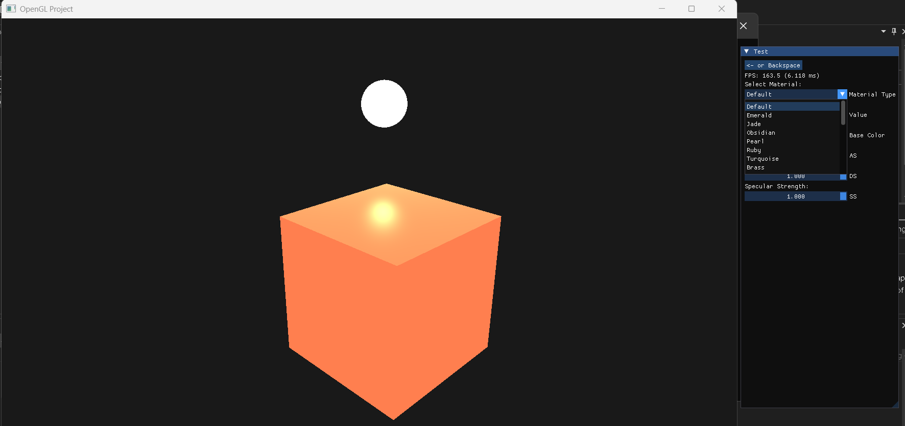
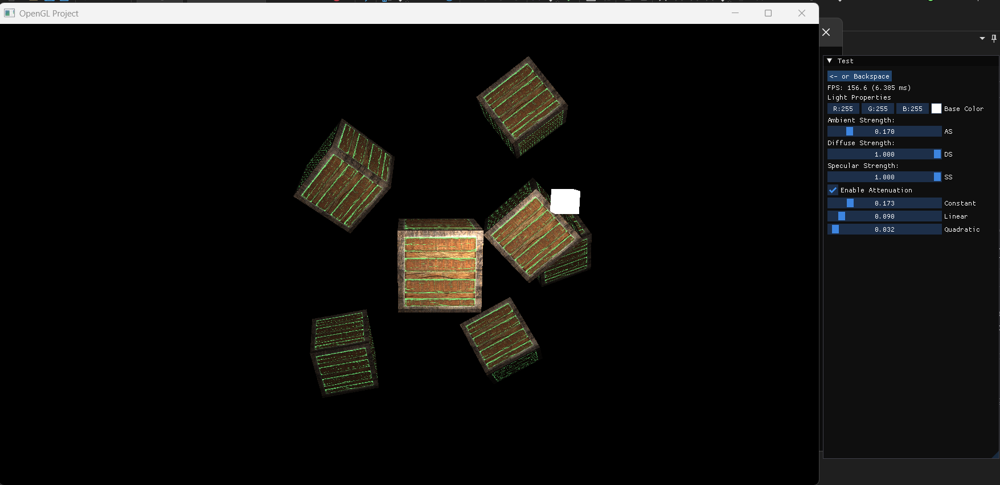

# OpenGL Explorations

This repository is a learning project that explores the fundamentals of 3D rendering with OpenGL. It includes a collection of experiments and demonstrations, integrated with ImGui for easy exploration and modification of parameters.

## Gallery
Here are some project screenshots and a video:

### Videos
https://github.com/user-attachments/assets/b141a3f7-1838-497a-84b2-56b992c2555f

### Screenshots

  
    
    
    
    
    

## Features
  - Render Game Window (Clear Color)
  - Render Triangle
  - Render Square
  - Load 2D Texture
  - Render Sphere (UV Sphere)
  - Cube Rendering With Lighting Effect and Materials
  - Cube With Texture and Lighting
  - Fractal Brownian Motion Plane With Lighting
  - Load and Tessellate Height Map
  - Load 3D model using Assimp
  - Particles in 3D (Implements in CPU)

## Getting Started
You can follow same instrunctions on `https://github.com/Shreyas9699/opengl-base-template` to set it up.
 __OR__ 
You can follow the _The Cherno_ [_Instrunctions_](https://www.youtube.com/playlist?list=PLlrATfBNZ98foTJPJ_Ev03o2oq3-GGOS2)

### Prerequisites

- OpenGL 3.3 or higher
- GLFW
- GLEW
- GLM
- stb_image
- ImGui

## Usage

- Use the ImGui interface to modify rendering parameters in real-time.
- Explore different rendering techniques by selecting from the available demos.

## Acknowledgments

- [The Cherno](https://www.youtube.com/@TheCherno) for the OpenGL tutorials and guidance.
- [LearnOpenGL](https://learnopengl.com/) for providing excellent tutorials and resources.
- [The Book of shader](https://thebookofshaders.com/) to guide through the complex shader.
